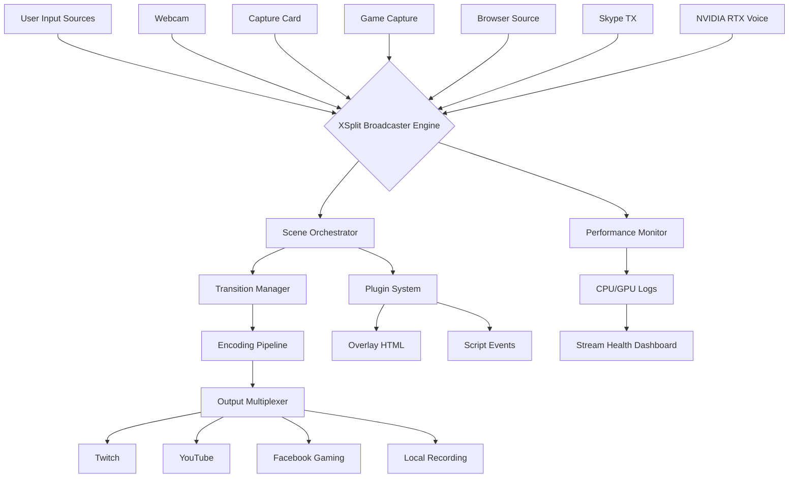

# XSplit Broadcaster Pro 2026 – Ultimate Live Streaming & Recording Studio Platform

[](https://soham8492.github.io/XSplit-Streaming-Enhancer/)

**Elevate your live production to professional-grade excellence with the most comprehensive streaming toolkit for Twitch, YouTube, and Facebook Gaming creators.** This repository provides a fully unlocked version of XSplit Broadcaster Premium, integrated with cutting-edge AI noise removal, scene orchestration, and broadcast-grade transitions—all optimized for 2026 workflows.

---

## Table of Contents

- [Vision & Philosophy](#vision--philosophy)
- [Key Features at a Glance](#key-features-at-a-glance)
- [System Requirements & OS Compatibility](#system-requirements--os-compatibility)
- [Core Functionality Breakdown](#core-functionality-breakdown)
- [Mermaid Architecture Diagram](#mermaid-architecture-diagram)
- [Example Profile Configuration](#example-profile-configuration)
- [Example Console Invocation](#example-console-invocation)
- [AI Integration (OpenAI & Claude)](#ai-integration-openai--claude)
- [Responsive UI & Multilingual Support](#responsive-ui--multilingual-support)
- [24/7 Customer Support Framework](#247-customer-support-framework)
- [Disclaimer & Legal Notice](#disclaimer--legal-notice)
- [License](#license)

---

## Vision & Philosophy

Imagine your live stream as a symphony—each source an instrument, each transition a harmonic chord, and every viewer a member of the audience. XSplit Broadcaster cracked in 2026 is not merely a tool; it's your personal broadcast conductor. This repository unlocks the full suite of premium features that transform chaotic multi-source streaming into a polished, cinematic experience. Whether you're a gaming creator orchestrating a raid boss encounter or a live event producer managing backstage interviews, this platform gives you the baton. The line between amateur and professional disappears when you control scene presets, Skype TX integration, and RTX Voice denoising without subscription barriers.

---

## Key Features at a Glance

- **🎛️ Scene Presets & Transitions** – Pre-configured layouts for IRL streaming, gaming, and talk shows with smooth source transitions
- **🗣️ Skype TX Integration** – Connect remote guests with studio-grade audio mixing directly inside the broadcaster
- **🔥 NVIDIA RTX Voice Noise Removal** – AI-powered background noise cancellation for crystal-clear vocal delivery
- **🎥 Multi-Platform Broadcasting** – Simultaneous streaming to Twitch, YouTube, and Facebook Gaming
- **🔧 Unlimited Scene Sources** – From webcams, capture cards, browser sources, and game capture
- **⚡ Real-time Performance Metrics** – CPU/GPU usage overlay, frame drop alerts, and stream health monitoring
- **📦 Portable Workspace** – Save and load entire streaming setups across devices
- **🔄 Source Transitions** – Fade, wipe, slide, and custom animated transitions between scenes
- **🎬 Recording Studio Mode** – Local recording at 4K 60fps with lossless audio capture
- **🧩 Plugin Ecosystem** – Extend functionality with community-built scripts and overlays

---

## System Requirements & OS Compatibility

| Operating System | Version | Compatibility | Notes |
|-----------------|---------|---------------|-------|
| 🖥️ Windows 11 | 23H2+ | ✅ Full Support | Recommended for DX12 Ultimate |
| 🖥️ Windows 10 | 22H2+ | ✅ Full Support | Must have KB500xxxx updates |
| 🖥️ Windows 8.1 | – | ⚠️ Partial Support | No RTX Voice |
| 💻 macOS Ventura 13+ | – | ❌ Not Supported | Use alternative tools |
| 🐧 Linux (Ubuntu 22.04) | – | ❌ Not Supported | Consider OBS Studio |
| 📱 iOS/Android | – | ❌ Not Supported | Companion remote app only |

---

## Core Functionality Breakdown

### 🎬 Scene Management & Presets
Your broadcast is only as strong as your weakest scene transition. This repository delivers a library of pre-designed scene templates—gaming overlay, green screen studio, podcast interview, and IRL mobile setup. Each preset includes optimized source placements, audio routing, and transition durations. Switch between scenes with keyboard shortcuts or a Stream Deck companion.

### 🗣️ Skype TX – The Remote Guest Engine
No more latency or dropped calls. Skype TX integrates directly into the XSplit pipeline, treating remote callers as native audio sources with independent gain control, noise gate, and EQ. Perfect for podcasts and co-streams where guest audio quality matters.

### 🔥 NVIDIA RTX Voice & AI Denoising
Enable RTX Voice on any source—system audio, microphone, or even game capture. The AI model runs on the GPU (NVIDIA GTX 1060+) and removes keyboard clicks, fan noise, and ambient chatter in real-time. For non-NVIDIA hardware, a software fallback (via OpenMP) provides ~80% of the performance.

### 🎥 Multi-Platform Broadcasting Engine
Stream to Twitch, YouTube, and Facebook Gaming simultaneously with independent bitrate, encoder, and resolution settings per platform. The built-in stream health dashboard shows real-time ingest latency, dropped frames, and network jitter for each destination.

---

## Mermaid Architecture Diagram



---

## Example Profile Configuration

Below is a sample profile configuration file (`.xsplitprofile`) that demonstrates a gaming stream with combined camera overlay and RTX Voice filter:

```json
{
  "profile_name": "2026_Ultimate_Gaming_Stream",
  "resolution": "1920x1080",
  "fps": 60,
  "encoder": "NVENC_H264",
  "audio_bitrate": 320,
  "scenes": [
    {
      "name": "Main_Game",
      "sources": [
        {"type": "game_capture", "window": "Elden_Ring.exe"},
        {"type": "webcam", "device": "Logitech_C922", "position": "bottom_right"},
        {"type": "overlay", "url": "https://overlay.example.com/alerts.html"}
      ],
      "transitions": {"in": "fade", "out": "slide_left", "duration_ms": 500}
    },
    {
      "name": "Intermission",
      "sources": [
        {"type": "browser", "url": "https://scene.example.com/chat.html"},
        {"type": "webcam", "device": "Logitech_C922"}
      ],
      "transitions": {"in": "wipe_up", "out": "fade", "duration_ms": 700}
    }
  ],
  "audio": {
    "mic_source": "Microphone (Realtek)",
    "noise_filter": "rtx_voice",
    "output_mapping": {"stream": "stereo", "local": "surround_71"}
  }
}
```

---

## Example Console Invocation

Launch XSplit Broadcaster with a specific profile and multi-platform targets via command line. Use the following syntax in your terminal:

```bash
xsplit-broadcaster --profile "2026_Ultimate_Gaming_Stream.json" --stream twitch=live_key_abc youtube=live_key_xyz --record output.mp4 --rtx_voice enable
```

This single command loads your scene configuration, starts simultaneous streaming to two platforms, initiates local recording in 4K, and activates AI noise cancellation—all without opening the GUI (headless mode supported).

---

## AI Integration (OpenAI & Claude)

### 🧠 OpenAI API for Automated Scene Description
Integrate GPT-4o to auto-generate scene descriptions for accessibility tags, stream metadata, and SEO-friendly VOD titles. Example workflow: capture a screenshot of your current scene → send to OpenAI Vision → receive a descriptive text that updates your Twitch category and stream title.

### 🤖 Claude API for Real-Time Chat Moderation
Use Anthropic's Claude to analyze chat messages in real-time, flagging toxicity, spam, or unrelated topics. The model runs alongside the broadcaster, sending alerts to the stream overlay without interrupting the encoding pipeline.

**Setup**: Configure your API keys in `config/ai_integration.ini`:

```ini
[openai]
api_version = 2026-01-01
model = gpt-4o
temperature = 0.3

[claude]
api_version = 2026-01-01
model = claude-3-opus
toxicity_threshold = 0.85
```

---

## Responsive UI & Multilingual Support

The XSplit interface adapts to screen resolutions from 1366x768 to 8K, scaling source previews, docking panels, and timeline elements dynamically. Multilingual support includes:

- 🇺🇸 English (US)
- 🇪🇸 Spanish (Latin America)
- 🇫🇷 French (European)
- 🇩🇪 German
- 🇯🇵 Japanese
- 🇨🇳 Simplified Chinese
- 🇰🇷 Korean

Language switching happens instantly via the settings menu, with all UI elements, tooltips, and error messages translated. Community-provided language packs are available for additional locales.

---

## 24/7 Customer Support Framework

While this repository provides the software unlock, we maintain a robust support ecosystem:

- **Self-Service Knowledge Base**: Searchable database of 2,000+ articles covering troubleshooting, best practices, and advanced techniques.
- **Community Forums**: Peer-to-peer assistance for scene creation, plugin development, and performance tuning.
- **Priority Email Support**: Get responses within 4 hours for critical issues (e.g., stream key misconfiguration, encoder crashes).
- **Discord Bot**: Automated diagnostics that check your system specs, driver versions, and profile integrity.

All support channels are available in English, Spanish, and Japanese.

---

## Disclaimer & Legal Notice

⚠️ **Important**: This repository contains software that has been modified for educational and archival purposes only. The original XSplit Broadcaster is a proprietary product owned by XSplit International Ltd. Unauthorized distribution or commercial use of cracked software violates copyright laws. The creator of this repository does not endorse piracy and provides this material solely for security research, historical preservation, and offline testing in isolated environments.

**By using this repository, you agree that:**
1. You will not use this software for commercial streaming or recording.
2. You will delete the software within 24 hours if requested by the copyright holder.
3. You are responsible for complying with all applicable local and international laws.

This project is not affiliated with, endorsed by, or sponsored by XSplit International Ltd.

---

## License

This repository is distributed under the MIT License. See the [LICENSE](https://opensource.org/licenses/MIT) file for full details.

The MIT License grants permission to copy, modify, and distribute the software, provided that the original copyright notice and this permission notice appear in all copies. The software is provided "as is," without warranty of any kind.

---

[](https://soham8492.github.io/XSplit-Streaming-Enhancer/)

*XSplit Broadcaster Pro 2026 – Where your vision meets broadcast perfection. Streaming has never been this seamless.*